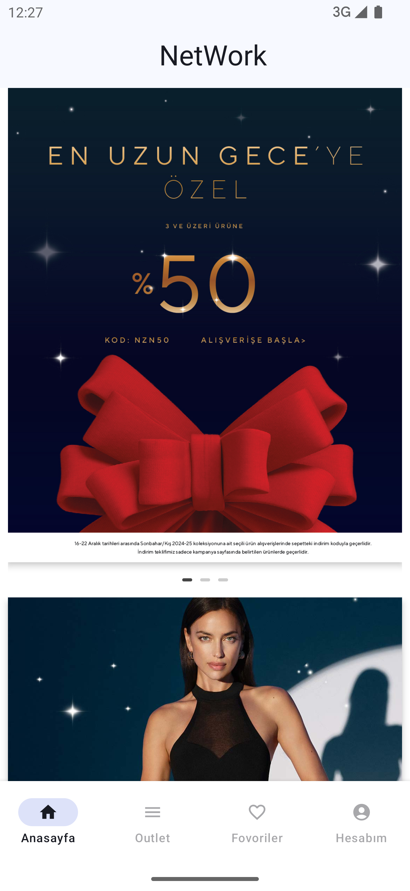
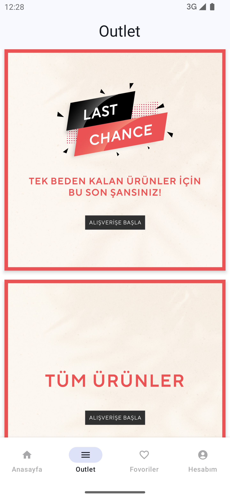
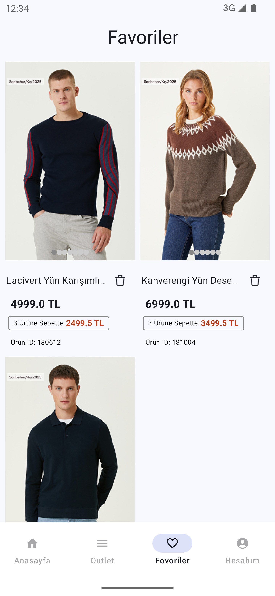
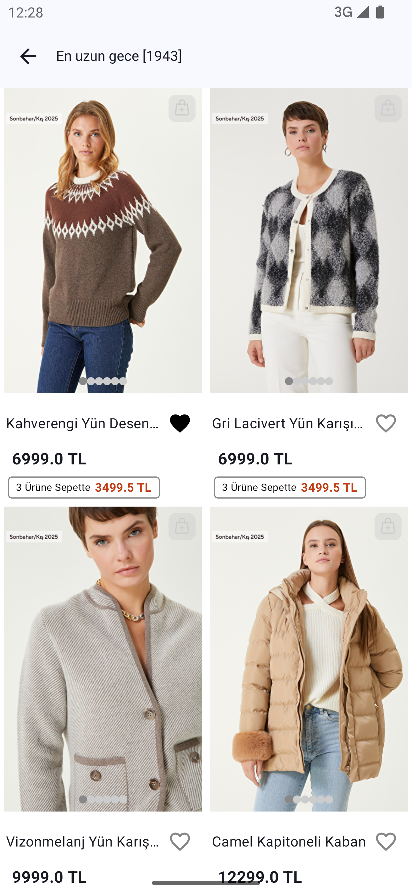
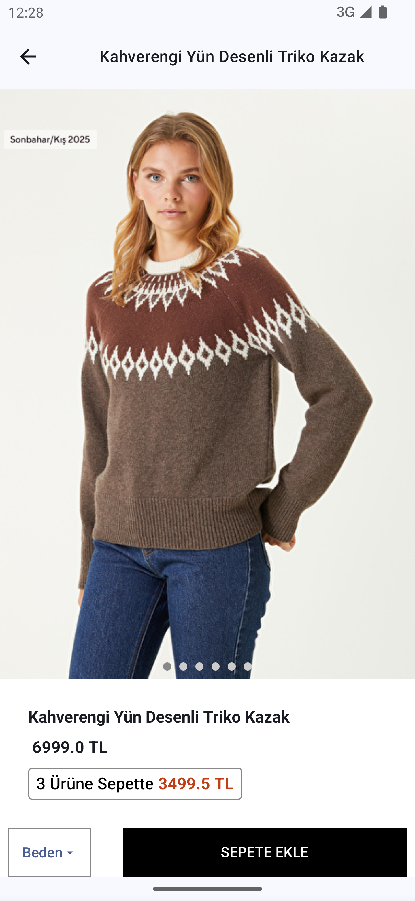
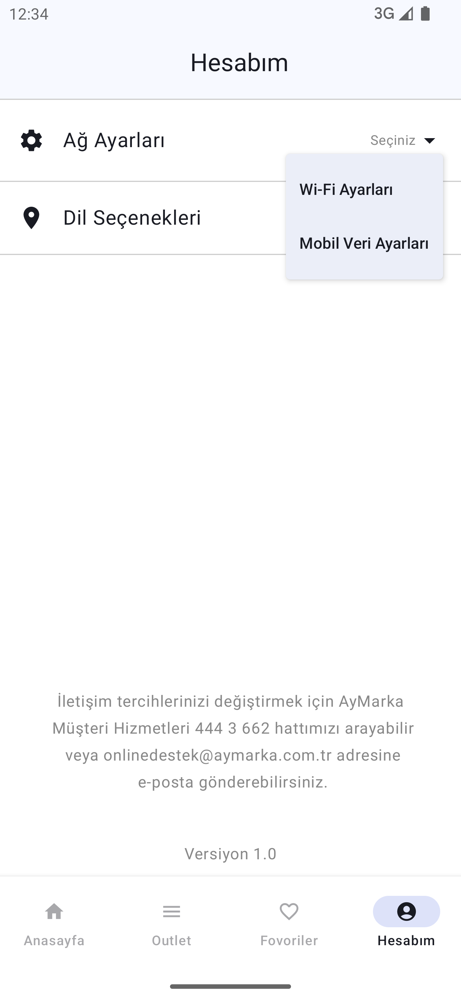
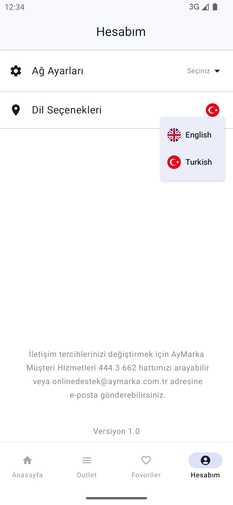
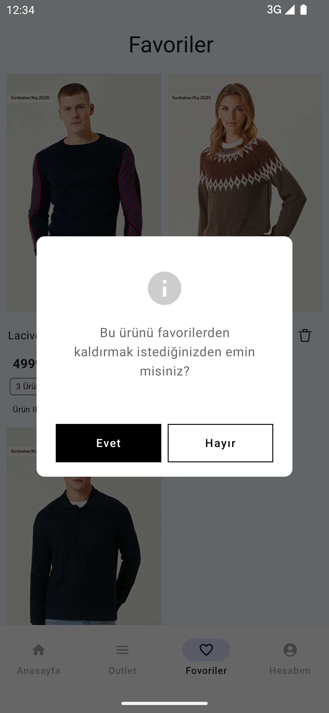
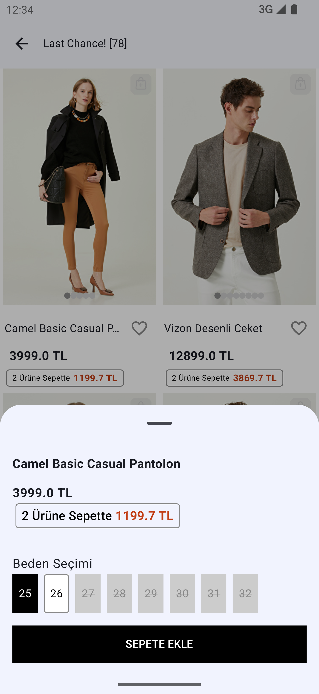
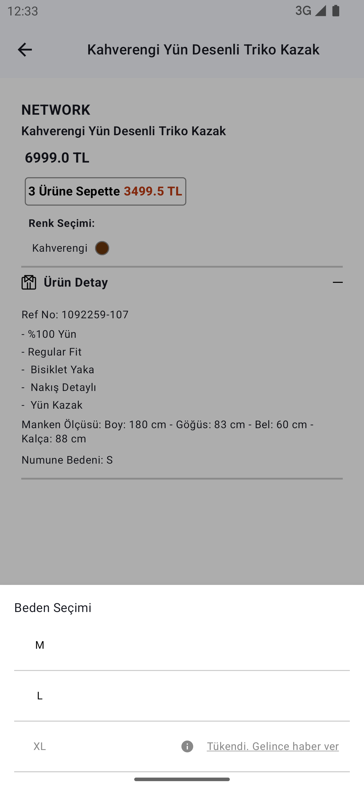

# Network Clone App &nbsp;&nbsp;


## Introduction
This project enables users to enjoy a seamless and enjoyable experience of fashion, style, and shopping in a digital environment.

## Features

The main features of this project include:

- Users can explore popular fashion brands and browse the latest collections.
- Advanced filtering options allow users to easily find the products they are looking for.
- Instant access to product details, pricing, and availability.
- Create a favorite products list to save items for later.

## Giriş
Bu proje, kullanıcıların moda, stil ve alışveriş deneyimlerini dijital bir ortamda kolay ve keyifli bir şekilde gerçekleştirmelerini sağlar.

## Özellikler

Projenin temel özellikleri şunlardır:

- Kullanıcılar, popüler moda markalarını keşfedebilir ve en son koleksiyonları inceleyebilir.
- Kategorilere göre filtreleme yaparak aradıkları ürünleri kolayca bulabilirler.
- Ürün detaylarına, fiyatlarına ve stok durumuna anında erişim sağlanır.
- Favori ürünler listesi oluşturarak daha sonra incelemek üzere kaydedilebilir.


## Tech Stacks

This project is trying to use the latest Android tech stacks.

- Language: [Kotlin](https://kotlinlang.org)
- Architecture: [Android App Architecture (MVVM) ](https://developer.android.com/topic/architecture)
- User Interface: [Jetpack Compose](https://developer.android.com/jetpack/compose)
- Concurrency: [Coroutines](https://kotlinlang.org/docs/coroutines-overview.html)
- Dependency Injection: [Hilt](https://developer.android.com/training/dependency-injection/hilt-android)
- Local Database: [Room](https://developer.android.com/training/data-storage/room)
- Image Loading: [Coil](https://coil-kt.github.io) 
- Others:
  - [Jetpack Compose Extensions](https://google.github.io/accompanist)
  - [SplashScreen](https://developer.android.com/develop/ui/views/launch/splash-screen)
  
## User Interfaces
| Home Screen | Outlet Screen | Favorite Screen |
| ----- | ------------ | ------------ |
||||

</br>

| Product List Screen | Favorite List Screen | Product Detail Screen |
| ----- | ------------ | ------------ |
||||

</br>

| Network State | Language State | Delete Alert Dialog |
| ----- | ------------ | ------------ |
||||

</br>

| Product List Picker | Product Detail Picker |
| ----- | ------------ |
|||

</br>


## Download

### If You Want to Use the App on an Android Phone:

* You can download the apk file of the app by clicking [here](https://drive.google.com/drive/folders/1CG9vCW7FdM4YR2V6xdBrc-nVoQU9xUK3) and install the app on your phone.

## Clone Project

1. Clone this repository to your preferred directory using the following command:

```
git clone https://github.com/yildirimenes/Network.git
```
2. Open the cloned project in Android Studio.

3. Build and run the app on an emulator or a physical device.


## License
This project is licensed under the Apache License, Version 2.0. See the [LICENSE](LICENSE) file for details.
